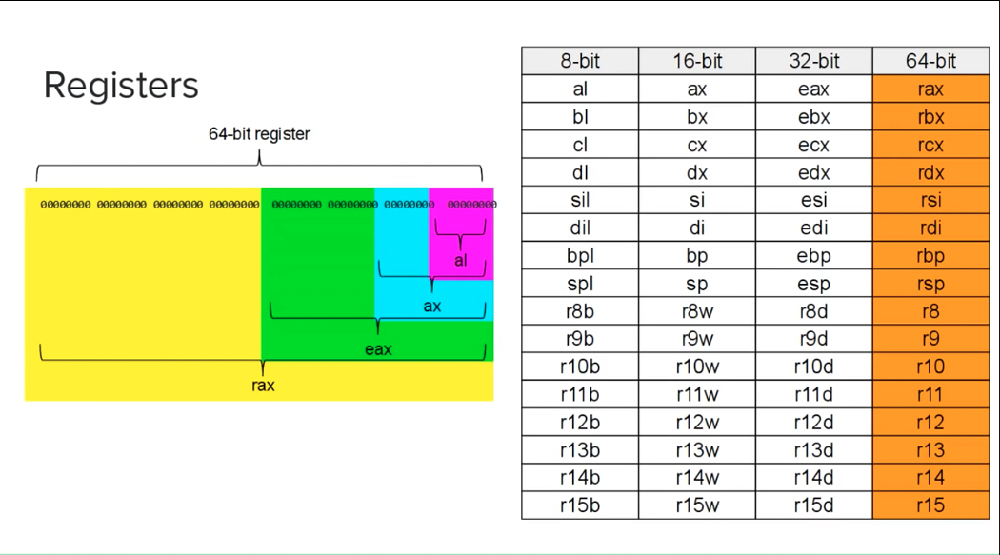

# x86-64-linux-assembly-study
Study of assembly language using the x86_64 architecture.

## The Basics

Here is a very basic introduction of the language and also an explanation of the hello.asm example.

db -> stands for "define bytes". Its where we define raw bytes of data to insert into the code.

The number 10 after the string definition its the same as "\n". 

text -> this the name assigned to the address in memory that this data is located in. It can be any name.

### Register

Register are a part of the processor that temporarily holds memory.

In the x86_64 architecture, register hold 64 bits.

### Sections

All x86_64 assembly files have three sections, the ".data" section, the ".bss" section, and the ".text" section.

The data section is where all the data is defined before compilation.

The bss section is where data is allocated for future use.

The text section is where the actual code goes. 

### Labels

A label is used to label a part of code.

Upon compilation, the compiler will calculate the location in which the label will sit in memory.

Any time the name of the label is used afterwards, that name is replaced by the location in memory by the compiler. 

#### The "Star" label

The "_start" label is essential for all programs.

When your program is compiled and later executed, it is executed first at the location of "_start".

If the linker cannot find "_start", it will throw an error. 

#### Global

The world "global"is used when you want the linker to be able to know the address of some label.

The object file generated will contain a link to every label declared "global". 

### System Call

A system call, or a syscall, is when a program requests a service from the kernel.

System calls will differ by operating system because differente operating systems use different kernels.

All syscalls have a ID associated the them. They also take arguments, which is a list o inputs.

#### sys_write

This is the syscall to show data on the screen.

#### sys_exit

